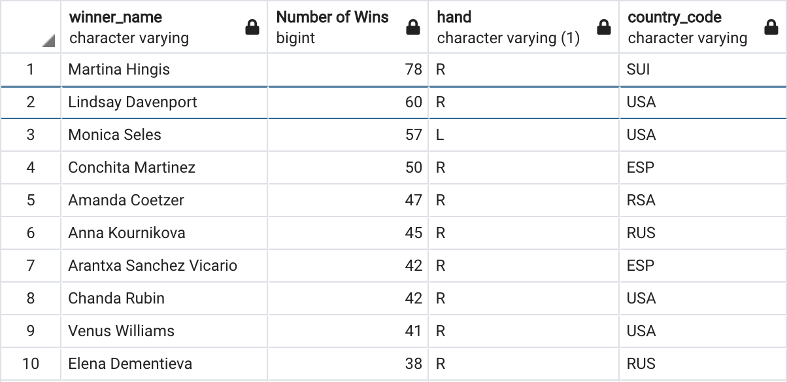

# Tennis-Analysis
ProstgreSQL

## Overview

This project analyzes data from a Women's professional tennis tournament. This dataset is comprised of two csv files provided by the Data Analytics Bootcamp at the University of North Carolina at Chapel Hill. The goal is to determine: 1) the distribution of hand-dominance (right-handed vs left-handed) among professional players, 2) the distribution of countries winning in this tournament and 3) analyze the performance of the famous American tennis player Serena Williams.

## Results

### Dominant Hand

The dominant hand of most players was undetermined (U). Of the players whose dominant hand was known, right-handed players outnumbered left-handed players 10 to 1.

Of the players who won matches, 87% were right-handed and 10% were left-handed. The players with an undetermined hand-dominance won only 3% of matches. This suggests that the hand-dominance of only winning players was reigourously recorded. 

### Country
The majority of matches were won by the USA, at 18%. France was second at 10%. A majoirty of the countries won less than 1% of the maches. The countries winning most of the matches are primarily Western countries, which could be due to the fact that the tournament was located in the West.

### Top Players

The following table shows the players with the most number of wins in the tournament. Martina Hingis from Switzerland won the most at 78 wins. She is right-handed. In fact, all except for 1 of the top ten players were right-handed. Do right-handed players have an advantage? Or perhaps they win more often because most players are right-handed?
 

### Serena Williams

Serena Williams won a total of 37 matches and lost 8. This placed her just out of reach of being in the top 10 players with most wins, with Elena Dementieva (10th highest) having 38 wins.

